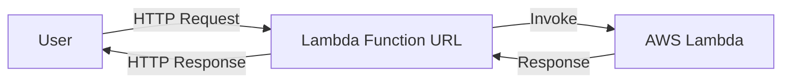

# bedrock-lambda-test

CDK project to deploy a Lambda function.
You can access the Amazon Bedrock() via Lambda Function URLs.

```bash
curl -s 'https://<url-id>.lambda-url.ap-northeast-1.on.aws/?prompt=hello!'
{"message": "Success", "method": "GET", "queryParams": {"prompt": "hello!"}, "pathParams": {}, "response": "\\nHi! How can I assist you today?"}
```


